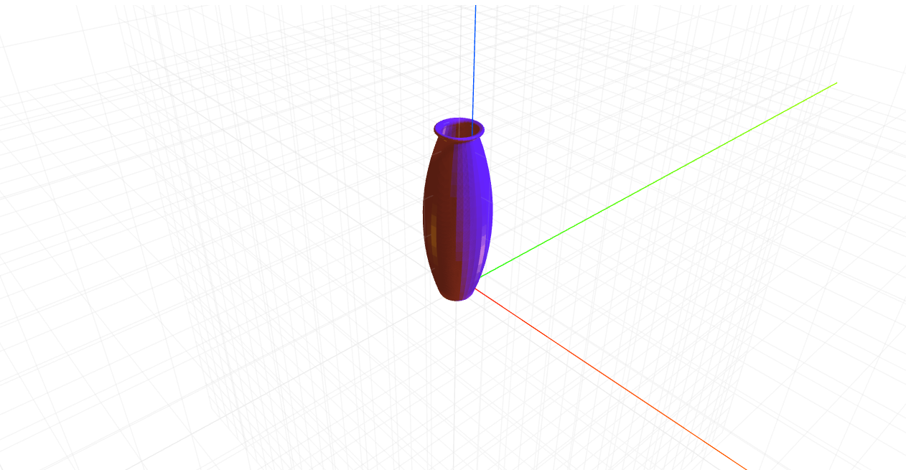

# craft-vase

# Install
`$ npm install craft-vase`

# Parameters
```sh
resolution - determines how many sides the vase will have.
```

# Example
```html
<craft>
	<craft name="vase" module="craft-vase"/>
	<vase></vase>
</craft>
```

